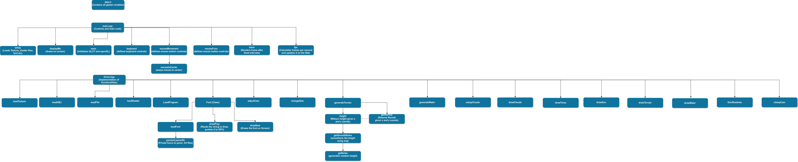

# Valley-Terrain-Modelling
An opengl minor project for Computer Graphics Course (CS 352)

# Required Libraries
Make sure the following libraries are present in your system.
- glut
- GLU
- GL
- glfw
- X11
- Xi
- dl
- GLEW
# Build Instructions

```
mkdir build  
cd build
cmake ..
make
./sim
```
Relevant source files :-
src/main.cpp
include/data.h
include/funcs.hpp

Flowchart :-

